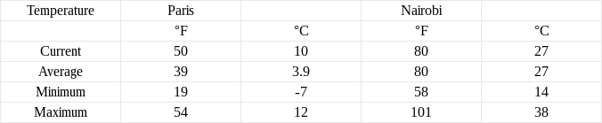

# SpreadsheetDB weather JS demo

## Presentation
This demo gathers weather data from two cities (Paris, France and Nairobi, Kenya) into [SpreadsheetDB](https://www.spreadsheetdb.io) and displays it in a simple spreadsheet.

## Dependencies
To install the dependencies use npm install.
```
$ npm install
```

## Usage
To use this demo you need a [SpreadsheetDB](https://www.spreadsheetdb.io) account, your
identifiers will be refered to as "email" and "password".
```
$ node weather.js <email> <password>
Server running at http://127.0.0.1:8000/
```

You can then visit http://127.0.0.1:8000/ to display the weather table, it looks like
this:



Feel free to let the demo run longer to gather more data.

## How does it work?
### Weather data
This demo uses the [Yahoo Weather API](https://developer.yahoo.com/weather/). Every 5 minutes (you can change this value with the --interval option) weather data is fetched from the Yahoo Weather API and pushed as a [SpreadsheetDB record](https://www.spreadsheetdb.io/doc/api#post-record). This happens in [records.js](records.js). Since SpreadsheetDB records are schema-free, no parsing / formatting / conversion is required.

### Spreadsheet creation
At launch time, the [spreadsheet](spreadsheet.json) is created by
[spreadsheet.js](spreadsheet.js) if it does not exist.

### Spreadsheet display
This demo runs a web server that displays the spreadsheet ([server.js](server.js)). It parses the JSON resulting from the [GET /spreadsheet](https://www.spreadsheetdb.io/doc/api#get-spreadsheet) API call and generates a simple HTML page.
