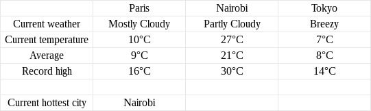

# SpreadsheetDB weather JS demo

## Presentation
This demo gathers weather data from 3 cities (Paris, Nairobi and Tokyo) into [SpreadsheetDB](https://www.spreadsheetdb.io) and displays it in a simple spreadsheet.

## Dependencies
To install the dependencies use npm install.
```
$ npm install
```

## Usage
To use this demo you need a [SpreadsheetDB](https://www.spreadsheetdb.io) account, your
identifiers will be refered to as "email" and "password".
```
$ node weather.js <email> <password>
Server running at http://127.0.0.1:8000/
```

You can then visit http://127.0.0.1:8000/ to display the weather spreadsheet, it looks like
this:



Host and port can be set with the environment values HOST and PORT, default values are
"127.0.0.1" and 8000.

Let the demo run longer to gather more data.

## How does it work?
### Weather data
This demo uses the [Yahoo Weather API](https://developer.yahoo.com/weather/). Every 5 minutes (you can change this value with the --interval option) weather data is fetched from the Yahoo Weather API and pushed as a [SpreadsheetDB record](https://www.spreadsheetdb.io/doc/api#post-record). This happens in [records.js](records.js). Since SpreadsheetDB records are schema-free, no parsing / formatting / conversion is required.

### Spreadsheet creation
At launch time, the [spreadsheet](spreadsheet.json) is created by
[spreadsheet.js](spreadsheet.js) if it does not exist.

The `columnFilters` field in the spreadsheet sets 3 filters, so the 3 columns will display
values related to a specific city.

```json
{
    "1": "weather.location.city == \"Paris\"",
    "2": "weather.location.city == \"Nairobi\"",
    "3": "weather.location.city == \"Tokyo\""
}
```

Now let's take a close look at the "current temperature" forumla:
```
CONCATENATE(ROUND((LAST(weather.item.condition.temp) - 32) * 5 / 9, 0), "°C")
```

Multiple things happen here. First, the function [LAST(weather.location.city)](https://www.spreadsheetdb.io/doc/functions#last) returns the most recent value of location.city from the "weather" records.
After a little formula is applied ((x - 32) * 5 / 9). If converts a °F to a °C since the Weather API only gives °F.
Then we use [ROUND()](https://www.spreadsheetdb.io/doc/functions#round) to round the temperature since it is more conventionnal.
And to finish, we use [CONCATENATE()](https://www.spreadsheetdb.io/doc/functions#concatenate) to display a nice "°C" after the value.

We also need to add a "[filter](https://www.spreadsheetdb.io/doc/guide#filters)" field to filter records related to the city of Paris.

### Spreadsheet display
This demo runs a web server that displays the spreadsheet ([server.js](server.js)). It parses the JSON resulting from the [GET /spreadsheet](https://www.spreadsheetdb.io/doc/api#get-spreadsheet) API call and generates a simple HTML table.
